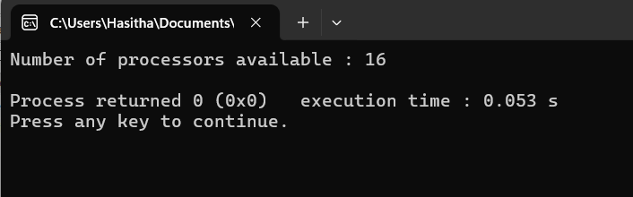

```diff
+ include <stdio.h>
+ include <omp.h>

- int main()
- {
    // Check whether how many CPU cores available in the computer
-    int num_procs = omp_get_num_procs();
-    printf("Number of processors available : %d\n", num_procs);
-    return 0;
- }
```

