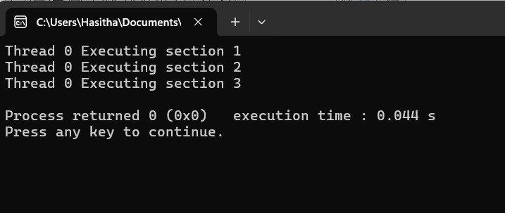
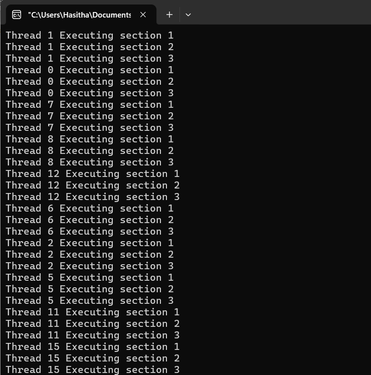
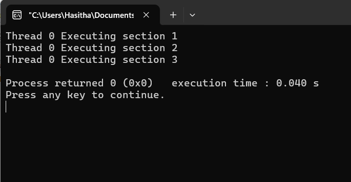
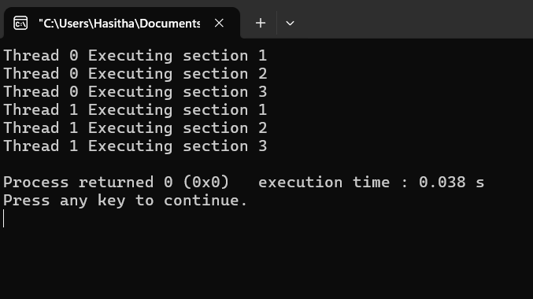

**Parallel Processing Practicle With using one random thread**
```diff
+ #include <stdio.h>
+ #include <omp.h>

- int main(){
 This pragma directive creates a team of threads. Each thread in the team will execute the enclosed parallel region.
- #pragma omp paralell
- {

 In here make the sections, so these sections execute from one thread. when i write a code this sections executed by using 2 threads, it will execute using one thread among used two threas.
 Else IF, I'm not use the sections, the code base execute parallelly using mentioned two threads (Threads are assign with randomly)
 Within the parallel region, this directive specifies that the enclosed code block will be divided into sections, and each section will be executed by one thread.
-     #pragma omp sections
-     {
 These are represent the sub sections
-         #pragma omp section
-         {
-             printf("Thread %d Executing section 1\n", omp_get_thread_num());
-         }

-         #pragma omp section
-         {
-             printf("Thread %d Executing section 2\n", omp_get_thread_num());
-         }

-         #pragma omp section
-         {
-              printf("Thread %d Executing section 3\n", omp_get_thread_num());
-         }
-     }

- }

- return 0;


- }
```


**Modify the Code for without using sections and including not mentioning the count of threads**
```diff
+ #include <stdio.h>
+ #include <omp.h>

-int main() {
-    #pragma omp parallel
-    {
-        printf("Thread %d Executing section 1\n", omp_get_thread_num());
-        printf("Thread %d Executing section 2\n", omp_get_thread_num());
-        printf("Thread %d Executing section 3\n", omp_get_thread_num());
-    }

-    return 0;
-}
```


**Modify the code for mentioning thread count one**

```diff
+ #include <stdio.h>
+ #include <omp.h>

-int main() {
-    #pragma omp parallel num_threads(1)
-    {
-        printf("Thread %d Executing section 1\n", omp_get_thread_num());
-        printf("Thread %d Executing section 2\n", omp_get_thread_num());
-        printf("Thread %d Executing section 3\n", omp_get_thread_num());
-    }

-    return 0;
-}
```



**Modify the code for mentioning thread count two**

```diff
+ #include <stdio.h>
+ #include <omp.h>

-int main() {
-    #pragma omp parallel num_threads(2)
-    {
-        printf("Thread %d Executing section 1\n", omp_get_thread_num());
-        printf("Thread %d Executing section 2\n", omp_get_thread_num());
-        printf("Thread %d Executing section 3\n", omp_get_thread_num());
-    }

-    return 0;
-}
```

