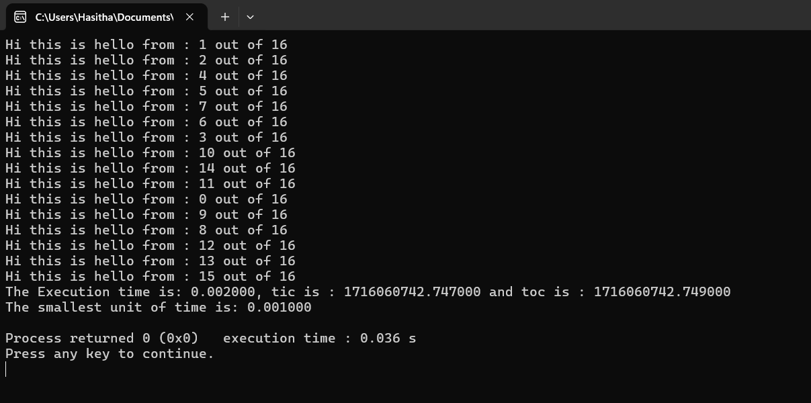
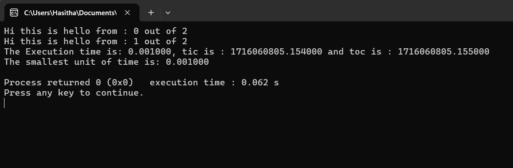

```diff
+ #include <stdio.h>
+ #include <omp.h>

- int main(){
     These are the variables number of threads and thread ID assigns
-    int num_threads,thread_id;
     Declares two double variables
-    double tic,toc;

     This represent the current time before parallel region executing
-    tic = omp_get_wtime();

     This gives the minimum unit when measure the time in this program (As the example can be measure the time with millisecond from this program)
-    double time = omp_get_wtick();

-    #pragma omp parallel 
-    {
-     num_threads = omp_get_num_threads(); // This command is used to check whether how many active threads include in computer
-     thread_id = omp_get_thread_num();    // This command is used to getting the thread id

-     printf("Hi this is hello from : %d out of %d\n", thread_id, num_threads);
-    }

     Current time after Parallel processing
-    toc = omp_get_wtime();
     Measure the real Execution time
-    printf("The Execution time is: %f, tic is : %f and toc is : %f\n", toc-tic,tic,toc);
     Measure the smallest time unit
-    printf("The smallest unit of time is: %f \n", time);
-    return 0;
-}
```


**We Can Restrict the Threads counts as this**
```diff
+ #include <stdio.h>
+ #include <omp.h>

- int main(){
     These are the variables number of threads and thread ID assigns
-    int num_threads,thread_id;
     Declares two double variables
-    double tic,toc;

     This represent the current time before parallel region executing
-    tic = omp_get_wtime();

     This gives the minimum unit when measure the time in this program (As the example can be measure the time with millisecond from this program)
-    double time = omp_get_wtick();

-    #pragma omp parallel num_threads(2) 
-    {
-     num_threads = omp_get_num_threads(); // This command is used to check whether how many active threads include in computer
-     thread_id = omp_get_thread_num();    // This command is used to getting the thread id

-     printf("Hi this is hello from : %d out of %d\n", thread_id, num_threads);
-    }

     Current time after Parallel processing
-    toc = omp_get_wtime();
     Measure the real Execution time
-    printf("The Execution time is: %f, tic is : %f and toc is : %f\n", toc-tic,tic,toc);
     Measure the smallest time unit
-    printf("The smallest unit of time is: %f \n", time);
-    return 0;
-}
```

