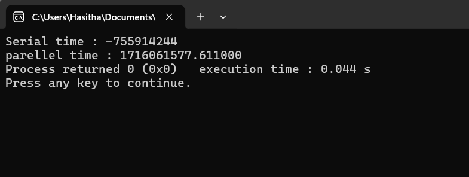

**Measure the time between serial Processing and the Parallel Processing**
```diff
+ #include <stdio.h>
+ #include <omp.h>

-int main()
-{

-    int sum = 0;
-    int i,j;

     function for serial processing
-    for (i=0; i<1000; i++){
-        sum += i;
    }

     Use the current time of the program and assign it to the tic variable
-    double tic = omp_get_wtick();

-    printf("Serial time : %d\n", tic);

     Assign the current time of the program to time1
-    double time1 = omp_get_wtick();

     function for parallel processing
-    #pragma omp parallel for reduction(+:sum)
-    for (j=0; j<1000; j++){
-        sum=0;
-        sum += j;
-    }

     getting the current time and assign it to the time2 variable
-    double time2 = omp_get_wtime();

-    printf("parellel time : %f", time2-time1);
-    return 0;
- }
```

