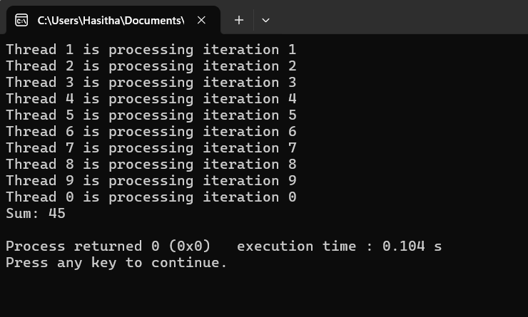

**This is for Getting Summention of the for loop using 10 threads as paralell processing**
```diff
+ #include <stdio.h>
+ #include <omp.h>

- int main(){
-    const int N=10;
-    int sum=0;
-    int i;

-    #pragma omp parallel
-   {
        Distributes the iterations of the loop among the threads in the team. Each thread executes a subset of the iterations independently.
-      #pragma omp for
-      for(i=0;i<N;i++){
-          printf("Thread %d is processing iteration %d\n", omp_get_thread_num());
-            sum+=i;
-        }
-    }
-    printf("Sum: %d\n", sum);
- }
```

