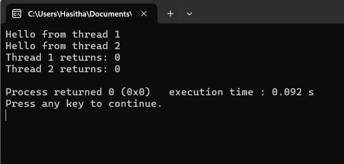

```diff

+ #include<stdio.h>        //input output
+ #include<stdlib.h>      //connect the libraries
+ #include<pthread.h>    //Getting Pthreads

pointers used to connect one place and another place
- void *print_msg(void *msg)              //creating functions with pointers
- {
-    char *message;                     //variable
-    message = (char *)msg;            // type castinng
-    printf("%s \n",message);         // formatting
- }


- void main()
- {
     These are variable to hold thread identifiers
-    pthread_t thread1,thread2;
    defining threads then if u want more threads then u can get like as thread3 , thread4

     these are msges that will passed to the threads
-    char *msg1="Hello from thread 1";
-    char *msg2="Hello from thread 2";
-    int iret1, iret2;

     In here pthread_create(&thread1, NULL, print_msg, (void *)msg1) this is function create a new thread
     The first argument of the pointer is pthread_t variable that will store the ID of the new thread
     The 3rd argument is the function that the thread will execute
     The 4th argument is the argument that will pass to the function

-    iret1=pthread_create(&thread1, NULL, print_msg, (void *)msg1);
-    iret2=pthread_create(&thread2, NULL, print_msg, (void *)msg2);


     Waiting for threads to finish ( The Function wait to the Thread to terminate )
-    pthread_join(thread1, NULL);
-    pthread_join(thread2, NULL);

     This prints the return values of the "pthread_create" fucntion, which indicate whether the threads were successfully created
     Typically, a return value of 0 indicate success
-    printf("Thread 1 returns: %d\n", iret1);
-    printf("Thread 2 returns: %d\n", iret2);

-    exit(0);

- }

```

