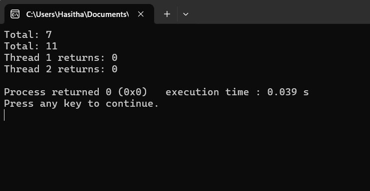

```diff

+ #include<stdio.h>//input output
+ #include<stdlib.h> //connect the libraries
+ #include<pthread.h>//one thread
```

**For the Explanation use the Pthread_practicle_01**
```diff
This code for getting summention of two number using pthreads
pointers used to connect one place and another place
creating functions with pointers
- int *print_msg(int* args)
- {
-     int* nums  = (int*)args;
-     int num1   = nums[0];
-     int num2   = nums[1];
-     int total  = num1 + num2;
-     printf("Total: %d\n", total);
-     return NULL;
- }


- void main()
- {
-     pthread_t thread1,thread2;    //defining threads //if u want more threads then u can get like as thread3 , thread4
-     int number1= 3;
-     int number2= 4;
-     int number3= 5;
-     int number4= 6;

-     int arr_one[2]={number1,number2};
-     int arr_two[2]={number3,number4};

-     int iret1, iret2;

-     iret1=pthread_create(&thread1, NULL, print_msg, (int*) arr_one); // please use the array
-     iret2=pthread_create(&thread2, NULL, print_msg, (int*) arr_two);


     Waiting for threads to finish
-     pthread_join(thread1, (NULL,NULL));
-     pthread_join(thread2, (NULL,NULL));

-     printf("Thread 1 returns: %d\n", iret1);
-     printf("Thread 2 returns: %d\n", iret2);

-     exit(0);

- }
```


