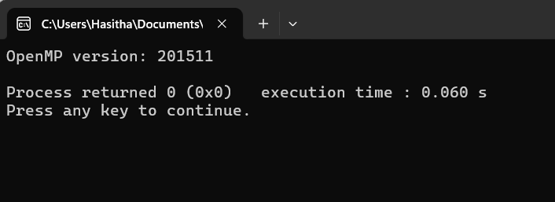

```diff
+ include <stdio.h>
+ include <omp.h>

- int main() {
    //check whether open MP version and correctly installed the open MP for the device
-    printf("OpenMP version: %d\n", _OPENMP);
-    return 0;
- }
```

