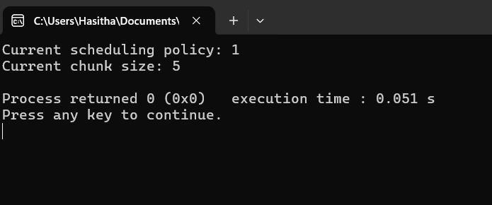

```diff
Chunk size  :  Divide the data in small small parts
+ #include <stdio.h>
+ #include <omp.h>

- int main(){
     Kind key word = this used to define the variable type
     omp_shed_t means represent the different scheduling policies in OpenMP

-    omp_sched_t kind;
-    int chunk_size = 5;

     this set function sets the sheduling policy and chunk size for the parallel loops.
     omp_sched_static use to divides the loop into equal-sized chunks and assign each chunk to a thread in the team.
-   omp_set_schedule(omp_sched_auto, chunk_size);

     omp_get_schedul retrieves the current scheduling policy and chunk size into the variables provided as argument
-    omp_get_schedule(&kind, &chunk_size);

-    printf("Current scheduling policy: %d\n", kind);
-    printf("Current chunk size: %d\n", chunk_size);
-    return 0;

- }
```


```

This chunk size represent the subset of in one processes for parallel process. and then static scheduling is use to each thread assign a fixed set of chunk. then the approach ensures that each thread gets a predictable workload.

In otherway dynamic scheduling assign chunks of work to threads dynamically at runtime.

Then, when we look at the guided scheduling it starts with larger chunks and gradually reduces the chunk size as iterations progress.

The chunk size determines how many iterations are assigned to each thread at a time. Choosing an appropriate chunk size is essential for efficient parallel execution.


Now We move on the what are the coding parts of the scheduling policies :
01) 1st policy --> omp_sched_static()  : This will be dividing loop into equal chunk sizes and each thread is assigned a chunk for the iteration to execute
02) 2nd policy --> omp_sched_dynamic() : This scheduling assigns iteration to a thread as become available
03) 3rd policy --> omp_sched_guided()  : This is also similar to the dynamic scheduling but the chunk size start larger to small
                                         and decreases all the time. This is specially good for load balancing.
04) 4th policy --> omp_sched_auto()    : This not need to mention the static, dynamic or guided. So, in that time this assign if own process and do execution.
```
`Real World Programming Example` : 
        Let's say you have a program that needs to process a large array of data in parallel. Each element of the array represents a task that can be executed independently. However, some tasks may take longer to complete         than others.You want to use OpenMP to parallelize the processing of this array across multiple threads. In your program, you can use OpenMP directives to specify how the loop iterations should be divided among the         threads using different scheduling policies.


 **This is for further more................**
 These all works in concurrent programming doing for scheduling the thread, when sheduling the thread use to
 giving a chance for all threads to run the whole process like firstly run a thread then giving the chance to
 other thread which are waiting in the cpu, then little bit done from that thread, then goes to other and terminating.
 but finally, all threads are complete their processes ...
